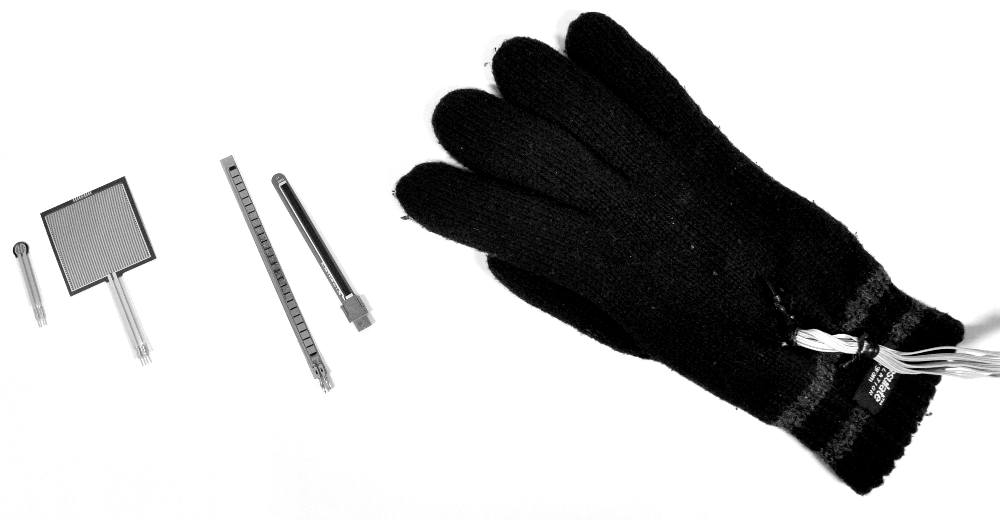

# 3. Bevegelsesanalyse

A> I dette kapitlet skal vi se nærmere på forskjellige kvalitative og kvantitative metoder for bevegelsesanalyse.

## Deskriptiv analyse

Det er ulike måter å analysere bevegelser på, og det er også mange måter å studere musikkrelaterte bevegelser på. Generelt kan vi skille mellom *deskriptive* og *funksjonelle* analysemetoder:

* *Deskriptive analysemetoder*: Bevegelser beskrives med utgangspunkt i deres *kinematiske* (for eksempel hastighet), *romlige* (størrelsen på rommet de utfolder seg i) og *temporale* dimensjoner (for eksempel frekvensomfanget).
* *Funksjonelle analysemetoder*: Bevegelser studeres med tanke på funksjonene de har i en viss kontekst, for eksempel om de er lydproduserende, lydmodifiserende, osv.

Når man skal studere bevegelser er det vanlig å begynne med en deskriptiv analyse, og deretter bruker man dette som utgangspunkt for en funksjonell analyse. I dette og neste kapittel skal vi se på forskjellige former for deskriptiv analyse. I kapittel 5 og 6 ser vi nærmere på funksjonell analyse.

Én av hovedutfordringene i studiet av bevegelser er deres flyktige natur. Bevegelser utfolder seg i tid og rom. Studerer man bilder, kan man bevare et fotografi, studerer man lyd, kan man gjøre et lydopptak for ettertiden. Det er derimot ikke like enkelt å ”ta opp” bevegelser. I dette avsnittet skal vi se nærmere på noen av de forskjellige teknikkene som finnes, og fordeler og ulemper ved disse.

Det har etter hvert vokst frem en rekke forskjellige teknologier for å registrere bevegelser, og disse kalles med en samlebetegnelse for *motion capture* på engelsk. Motion capture oversettes gjerne til *bevegelsessporing* på norsk. Målet med bevegelsessporingssystemer er å ta opp og lagre informasjon om bevegelser, for deretter å bruke dette som utgangspunkt for senere analyser. Det er altså snakk om en form for deskriptiv analyse, der deler av bevegelsen registreres og lagres digitalt. Man kan skille mellom følgende teknikker:

* elektromagnetiske systemer
* mekaniske systemer
* kinetiske systemer
* optisk-visuelle systemer
* optisk-infrarøde systemer
* fysiologiske systemer

Alle disse har igjen en rekke underkategorier som vi skal se nærmere på i de etterfølgende avsnittene.

## Elektromagnetiske systemer

Et *elektromagnetisk bevegelsessporingssystem* er basert på at det settes opp et elektromagnetisk felt rundt en *sender*. Deretter kan man ved å bruke en magnetisk *sensor* påvirke dette feltet. Ved å måle endringene i feltet kan man beregne hvor sensoren befinner seg, både posisjon i tre dimensjoner og rotasjon i tre dimensjoner. Dette gir da totalt seks frihetsgrader per sensor. Figur 7 viser et bilde av et elektromagnetisk system i bruk.

De elektromagnetiske systemene har vært populære ettersom de gir resultater med både høy oppløsning og hastighet. Det er også en fordel at man får informasjon om både posisjon og rotasjon fra sensorene, totalt seks dimensjoner per sensor. Dette gjør det enkelt å beregne både hastighet og akselerasjon fra signalet. Hver av sensorene identifiseres separat, så i motsetning til de andre systemene vi skal se på senere kan ikke sensorene forveksles med hverandre.

Ulempen med elektromagnetiske systemer er at rekkevidden ofte er begrenset, gjerne til en radius på bare et par meter fra senderen. Et annet problem er at det elektromagnetiske feltet kan oppleves som ubehagelig av personer som er sensitive for stråling. Så selv om det er mulig å øke styrken til feltet for å øke rekkevidden, er ikke dette nødvendigvis ønskelig rent helsemessig. Metallelementer som befinner seg innenfor målesonen, kan også påvirke systemet. Dette har vært et problem i forbindelse med observasjonsstudier av pianister, ettersom metallet i klaveret har gjort systemet upresist. Man kan løse dette problemet ved å kalibrere systemet for å kompensere for endringene i feltet, men det krever mye ekstraarbeid. Enda en ulempe med slike elektromagnetiske systemer er at sensorene er relativt store, og at kablene fra sensor til mottaksstasjon kan oppleves som unødvendig tykke. I den senere tid har det blitt utviklet trådløse sensorer til slike elektromagnetiske systemer, men disse sensorene er enda større enn sensorene med kabel. Resultatet er at et slikt sensorsystem i stor grad påvirker personen som studeres, og bevegelsene som denne kan utføre.

Alt i alt fungerer elektromagnetiske systemer bra hvis man skal måle noen få punkter innenfor et lite område. Når det gjelder hastighet, nøyaktighet og presisjon, er slike systemer bedre, billigere og mer stabile enn mange av de andre systemene vi skal se på. Imidlertid gjør de mange begrensningene, og særlig de store sensorene og den korte rekkevidden, at slike systemer har begrenset nytte i analyse av musikkrelaterte bevegelser.

## Mekaniske systemer

*Mekaniske systemer* bruker ulike sensorer som kan registrere bøying, strekking eller trykk når kroppen beveger seg. Slike sensorer finnes i en rekke former og størrelser og kan kombineres på mange forskjellige måter. Det finnes noen få ferdige systemer som er beregnet på bevegelsesanalyse, men det vanligste er nok at man utvikler sitt eget system basert på enkeltsensorer (se figur 8).

Fordelen med slike systemer er at de i motsetning til elektromagnetiske systemer ikke krever et felles referansepunkt som det måles ut fra. Derimot vil hver av sensorene måle bevegelse hver for seg, og dataene fra hver enkelt sensor vil kunne kombineres på forskjellige måter. Sensorene i seg selv kan være små og lette, og kan sys fast i klærne eller i en drakt som man tar på seg. Mekaniske systemer kan være bærbare og gi fleksibilitet for brukeren. Hvis man i tillegg bruker en trådløs sender, er man ikke avhengig av å være kablet til en datamaskin når man bruker systemet.

Ulempen med mekaniske systemer er at det kan bli mange sensorer festet på kroppen eller i klærne. Hvis ikke alt sys inn i en drakt, er det mange kabler som må trekkes langs kroppen. Det kan føles ubehagelig å ha på, særlig hvis man ønsker full bevegelighet i musikalsk sammenheng. Et annet problem er at dataene man får ut fra et slikt system, ikke nødvendigvis kan brukes direkte. Ettersom sensorene bare måler bøying, strekk eller trykk i ett enkelt punkt, kreves det mye matematikk for å beregne posisjon eller rotasjon fra et slikt system.

Konklusjonen er at mekaniske systemer er svært fleksible og kan fungere godt under gitte forutsetninger. Dette er grunnen til at mekaniske systemer brukes mye til forskjellige former for interaktiv musikk og dans, der musikeren eller danseren har sensorene på kroppen eller på objekter som manipuleres. Da vil sensorene kunne kobles direkte opp mot produksjonen av lyd eller video, uten at man nødvendigvis behøver å finne en nøyaktig beskrivelse av kroppen og bevegelsene som gjøres. Til vitenskapelig analyse er derimot slike systemer mindre brukt på grunn av at de er mindre presise, og at det kreves mye analysearbeid for å få ut relevant informasjon.

## Kinetiske systemer

En av de mest populære måtene å måle bevegelse og posisjon på er ved hjelp av sensorer som måler posisjon og bevegelse basert på jordens tyngdekraft. Her finnes det flere forskjellige typer sensorer, blant annet *akselerometre* som måler gravitasjonskreftene som virker på et objekt i bevegelse. Et akselerometer gir informasjon om endringer i bevegelse samtidig som den gir informasjon om rotasjon. Lignende sensorer er *gyroskop* som måler rotasjon i forhold til gravitasjonen, og *magnetometre* som måler retning i forhold til jordens poler på samme måte som et kompass.

Fordelen med kinetiske systemer er det store utvalget av sensorer i alle prisklasser, størrelser og kvaliteter (se figur 9). Ettersom kinetiske systemer gir direkte informasjon om bevegelse eller rotasjon, er de enkle å bruke i mange sammenhenger. Med en økt etterspørsel har prisene falt kraftig de siste årene, og sensorene bygges nå inn i en rekke kommersielle produkter. I dag brukes akselerometre til å utføre alt fra gestisk kontroll i mobiltelefoner til utløsning av sikkerhetssystemer i biler. Kinetiske sensorer er også populære i musikalsk sammenheng og blir brukt for å måle bevegelse i alternative elektroniske instrumenter.

Hovedutfordringen ved bruk av kinetiske systemer er at de bare gir informasjon om *endringer* i bevegelse, og ikke posisjonen til objektene som beveger seg. Det er mulig å beregne posisjonen ved å kombinere akselerometre og gyroskoper, men dette er ikke en enkel operasjon, og resultatet er ofte mindre presist enn ved bruken av for eksempel elektromagnetiske systemer.

Kinetiske sensorer, og da særlig akselerometre, fremstår i dag som den enkleste og billigste løsningen for å studere kroppsbevegelser. Systemene kan være små, trådløse, bærbare og fleksible, så hvis man ikke trenger å finne absolutt posisjon, er disse systemene godt egnet til analyse av musikkrelaterte bevegelser.

## Optisk-visuelle systemer

De tre systemene som er omtalt over, er alle basert på sensorer som plasseres på kroppen, og som registrerer rotasjon og bevegelse. En annen type bevegelsessporing som har blitt populært de siste årene, er *optiske systemer*. Vi skal her skille mellom optiske systemer som er basert på vanlig lys, *optisk-visuelle systemer*, og optiske systemer som er basert på infrarødt lys, *optisk-infrarøde* *systemer*. Begge disse systemene benytter teknikker for videoanalyse, og begge bruker et videokamera som utgangspunkt for den videre analysen, men de måler i forskjellige deler av det visuelle spekteret.

Et optisk-visuelt system tar utgangspunkt i signalet man får fra et vanlig videokamera. Det er en rekke fordeler knyttet til å bruke vanlig video som utgangspunkt for bevegelsesanalyse. Pris og tilgjengelighet er en viktig faktor, ettersom videoopptak nå er allment tilgjengelig i selvstendige kameraer og bygget inn i datamaskiner og mobiltelefoner. En annen fordel er at slik analyse kan gjøres uten at personen som observeres trenger å få festet sensorer på kroppen. Personen trenger ikke engang å være klar over at det skal gjøres opptak. Til musikalsk bruk kan dette være en fordel, siden det er mulig å bruke videoopptak av en konsert som utgangspunkt for en analyse.

Ulempen med videoanalyse er at oppløsning og hastighet vanligvis er lavere enn for de andre systemene som er omtalt i dette kapitlet. Et annet problem er at det er vanskelig å gjøre presise målinger av spesifikke punkter på kroppen, for eksempel hender og hode. Derfor bruker man gjerne videoanalyse for å se på globale bevegelsesegenskaper, som *bevegelsesmengde* og *bevegelsessentrum*. Vi skal se nærmere på disse teknikkene i kapittel 4. Et annet problem med videoanalyse er at man stort sett bare får informasjon om bevegelse i to dimensjoner (høyde og bredde), mesteparten av dybdeinformasjonen forsvinner. Man kan kompensere for dette ved å bruke flere kameraer i oppsettet, for eksempel ved å filme forfra, fra siden og ovenfra. De tre opptakene kan da kombineres for å finne posisjon i tre dimensjoner, men dette øker også kompleksiteten i analysen betraktelig.

Videoanalyse kan være den enkleste og raskeste måten å komme i gang med bevegelsesanalyse på. Ved hjelp av et helt vanlig videokamera og gratis programvare vil man kunne få ut informasjon om globale bevegelsesparametre. Dette kan altså gjøres uten at forsøkspersonen trenger å ha noen sensorer på kroppen, en fordel ved analyse av konserter. Det er også mulig å spore enkeltelementer i bildet, for eksempel hender og hode, men da ofte med lavere hastighet og presisjon enn de andre systemene vi har sett på.

## Optisk-infrarøde systemer

En av de mest avanserte metodene for bevegelsessporing som er tilgjengelig i dag, er *optisk-infrarøde systemer*. Slike systemer bruker mange av de samme teknikkene som er tilgjengelig i vanlig videoanalyse som er nevnt over, men i motsetning til å bruke det synlige spekteret bruker man infrarødt lys som utgangspunkt for analysen. De fleste optisk-infrarøde systemene er basert på å bruke flere kameraer (typisk mellom 4 og 16 kameraer) som posisjoneres rundt personen som skal observeres. Hvert kamera i oppsettet fungerer også som en lyskilde som sender ut infrarødt lys i rommet. Dette infrarøde lyset reflekteres av små kuler som festes på kroppen til forsøkspersonen (se figur 10). De reflekterte infrarøde lysstrålene blir filmet av kameraene, og datamaskinen gjør deretter en gjenkjenningsprosess av hvor i bildet kulene lyser opp. Ved å kombinere denne posisjonsinformasjonen fra hvert kamera er det mulig å finne den nøyaktige tredimensjonale posisjonen i rommet.

Avhengig av kvaliteten på systemet gjør denne metoden det mulig å registrere bevegelser med opp til flere tusen målinger per sekund og ned til millimeterpresisjon avhengig av hvordan kameraene er plassert. En annen fordel er at man i motsetning til de elektromagnetiske, mekaniske og kinetiske systemene kan feste så mange markører man ønsker på forsøkspersonen. Markørene er i seg selv veldig lette, så de begrenser i liten grad den fysiske utøvelsen.

Figur 10 viser et utsnitt fra et opptak av pianospilling med et infrarødt system. Etter at man har gjort opptak, kan man spille av bevegelsene, rotere bildet og zoome inn for å studere bevegelsene i mer detalj. Det er også mulig å legge på informasjon om bevegelsesbanene til hvert punkt, slik at man kan få en idé om hvordan punktene har beveget seg over tid. En slik visualisering kan dermed være med på å simulere vår evne til å ”se” en handling i tid og rom.

Målingene fra optisk-infrarøde bevegelsessporingssystemer har høy hastighet og presisjon, men dette er også den dyreste løsningen vi har sett på. Det er også den metoden som er mest tidkrevende å arbeide med, både fordi det tar tid å sette opp systemet og kalibrere kameraene, samt å feste markører på forsøkspersonen. Den største utfordringen med slike systemer er allikevel at man ikke har noen enkel måte å identifisere de ulike markørene på, fordi alle dukker opp som like punkter på skjermen etter opptak. Dette betyr at når man har gjort et opptak, må man i ettertid forsøke å rekonstruere hvilke markører som satt hvor på kroppen. Denne prosessen kan forenkles ved å feste flere markører i ulike mønstre som kan gjenkjennes automatisk. Det er også mulig å definere en biomekanisk kroppsmodell som hjelper til med å identifisere de forskjellige kroppsleddene og sannsynligheten for hvordan markørene beveger seg over tid. Allikevel vil det i praksis alltid være noe etterarbeid med å identifisere markører som av forskjellige grunner ”forsvinner” av syne under opptak. I musikalsk sammenheng har vi opplevd dette i pianoopptak der hendene overlapper hverandre på klaviaturet, slik at markører på den ene hånden ikke er synlige for noen av kameraene. Dette skaper etterarbeid med å rekonstruere hvordan hendene beveget seg, for å unngå at markører ”bytter” hånd.

Oppsummerende kan man si at optisk-infrarøde systemer er den løsningen som gir høyest hastighet og best oppløsning, men ikke uten tekniske utfordringer. I motsetning til flere av de ovennevnte systemene tar det både stor plass og er kostbart; det krever dessuten mye arbeid for å fungere optimalt. Slike systemer er gjerne laget til bruk i et laboratorium. Det har blitt gjort noen forsøk med å bruke optisk-infrarøde systemer til interaktiv musikk og dans, av for eksempel Dobrian og Bevilacqua (2003), men dette har vist seg å være mindre fleksibelt og stabilt enn kinetiske og mekaniske systemer. Til analysebruk og i kontrollerte laboratorieopptak er derimot optisk-infrarøde systemer en populær metode.

## Fysiologiske systemer

Alle systemene som er nevnt over, måler fysisk bevegelse i tid og rom på forskjellige måter. *Fysiologiske systemer* måler ikke bevegelse eller posisjon i seg selv, men informasjonen fra slike systemer kan allikevel fortelle oss mye om bevegelsene til en person. Det er ikke rom for å gå i detalj om slike systemer her, men det kan være verdt å nevne noen av de teknikkene som finnes.

Muskelspenning kan måles ved hjelp av *elektromyografi* (EMG), en teknikk for å registrere den elektriske aktiviteten i muskler ved å se på spenningsforskjeller som oppstår over tid. Det finnes flere forskjellige måter å gjøre dette på, både med overflate-elektroder og forskjellige typer nålelektroder. Måling av muskelspenning er direkte knyttet til bevegelsen som kommer etter, og er derfor relevant i musikalsk analyse. Det er også flere komponister og musikere som har arbeidet med bruk av muskelspenning for å styre musikalske systemer, som for eksempel Atau Tanaka (1993).

Pulsmåling kan også brukes til å studere bevegelsesaktivitet. Pulsen kan måles med *elektrokardiografi* (EKG), ved at et bånd med sensorer festes rundt brystet for å måle hjertets elektriske aktivitet. Det er også mulig å registrere pulsen med infrarøde sensorer som måler *blodtilstrømning* (BVP) i en finger. Sammen med respirasjonssystemer vil man da kunne se på hvordan pust og puls forandrer seg over tid. Dette kan være interessante mål i musikalsk sammenheng, særlig hvis de brukes i kombinasjon med en eller flere former for bevegelsesanalyse.

Også andre fysiologiske mål har vært brukt i musikalske studier. En relevant teknikk er *galvanisk hudrespons* (GSR) som måler endringer i fuktigheten i hendene. Denne teknikken er mest kjent fra de omdiskuterte ”løgndetektortestene”, men har også vært brukt til kontroll av musikalske parametre (Perez og Knapp 2008).

Hjerneaktivitet kan måles ved hjelp av lignende teknikker. I *elektroencefalografi* (EEG) fester man en serie elektroder på hodet for å måle elektrisk aktivitet i hjernen. EEG-systemer krever omfattende forberedelser og etterarbeid. Sensorer må festes på hodet, systemet må kalibreres, og ikke minst må data filtreres og bearbeides mye før man kan begynne selve analysen. EEG blir brukt til både analyse og syntese av musikk. En vanlig metode er å gi konkrete oppgaver samtidig som man måler EEG. Da kan man studere såkalte *event-related potentials* (ERP), endringer i den spontante elektriske aktiviteten knyttet til forskjellige kognitive oppgaver.

Av mer spesialiserte systemer for hjernemåling kan nevnes *magnetoencefalografi* (MEG). Den måler samme signal som EEG, men uten at det er nødvendig å koble til fysiske sensorer (Tanzer 2006). En annen teknikk som har blitt brukt til flere musikkognisjonsstudier, er *funksjonell magnetresonanstomografi* (fMRI) som måler funksjonell respons i hjernen ved å finne økt blodtilstrømning i aktive områder (Solso et al. 2005, 56). Dette krever imidlertid at forsøkspersonen sendes liggende inn i en magnetisk tunnel, noe som legger klare begrensninger på studiene som kan gjennomføres.

## Observasjonsteknikker

Metodene som er nevnt over, går ut på å bruke forskjellige teknologiske systemer for å registrere bevegelser. Man kan også bruke *observasjon* som en systematisk metode for å registrere og analysere bevegelser med utgangspunkt i egen kunnskap og erfaring. Særlig fysioterapeuter har arbeidet aktivt med å utvikle metoder for å beskrive og analysere bevegelser fra et fysiologisk perspektiv. Et eksempel på dette er den funksjonelle bevegelsesanalysen utviklet av Haugstvedt og Melhus (2008). Mange slike observasjonsteknikker er utviklet i tilknytning til en bestemt type analyse og er derfor bare av begrenset nytte hvis man ønsker å bruke dem til andre formål.

Musikk har hatt et velfungerende og utbredt notasjonsapparat i mange århundrer, noe som har gjort det mulig å nedtegne og kopiere musikkstykker for senere spilling. Særlig i vestlig kunstmusikk har det vært vanlig å bruke noter, og lesing og skriving av noter har vært en integrert del av musikkopplæringen. Det enkle, symbolorienterte systemet har åpnet for en rekke analyseteknikker og har vært brukt i store deler av musikkforskningen. Det samme kan ikke sies om dans og andre former for bevegelse. Selv om det har blitt utviklet flere forskjellige notasjonsformer for bevegelse opp gjennom århundrene, er få av disse i bruk i dag. Det er heller ingen av disse notasjonsformene som har en like stor utbredelse blant dansere som notesystemet har blant musikere.

I musikalsk sammenheng har det blitt utviklet flere forskjellige metoder som kan ses som en kombinasjon av bevegelsesanalyse og ergonomiske studier, gjerne med utgangspunkt i skadereduksjon. Eksempler på dette er *Alexander-teknikken* (Barlow 1975), *Rolfing* (Feitis 1978), *Expressive movement* (Pierce og Pierce 1989) og *Dalcroze* (Findlay 1971). Flere av disse teknikkene har sitt utspring i arbeidet til danseren, koreografen og bevegelsesforskeren Rudolf Laban (1879–1954), og i resten av dette avsnittet skal vi se nærmere på to av hans metoder: *Labanotasjon* og *Labans bevegelsesanalyse*.

## Labans notasjonsystem og bevegelsesanalyse

Laban arbeidet som danser og koreograf før han begynte å interessere seg for beskrivelse og analyse av bevegelser. Selv om hans teorier var dypt fundert i dans og dansebevegelser, var han opptatt av å lage et universelt system for bevegelsesanalyse. Han brukte derfor mye tid på å studere alle former for menneskelig bevegelse, blant annet hos fabrikkarbeidere. I 1928 presenterte Laban et system han kalte *Schrifttanz* i boken *Kinetographie Laban* (Guest 2004). Her hadde han utviklet en metode for å notere bevegelser ved hjelp av symboler langs en vertikal akse. Labans notasjonssystem, og hans omfattende bevegelsesanalyse har senere blitt utviklet i flere retninger, og dekker i dag mange forskjellige områder.

Når man skal nedtegne bevegelser ved hjelp av Labanotasjon er det ofte vanlig å begynne med en *motivbeskrivelse.* Dette er en redusert versjon av det fulle notasjonssystemet og muliggjør rask nedtegnelse av de viktigste elementene i en bevegelsessekvens. Tanken er at man kan starte med en motivbeskrivelse av de mest sentrale handlingene, for deretter å gå videre til en mer detaljert analyse og beskrivelse av bevegelsene.

Labanotasjon er et stort og omfattende system, og det krever mye tid å lære seg å skrive og lese notasjonen. Figur 11 viser eksempler på enkle bevegelsesmønstre nedtegnet med Labanotasjon. Her kan man se hvordan notasjonen tar utgangspunkt i en midtstrek som representerer sentrum i kroppen. Tiden løper vertikalt, så man leser Labanotasjon nedenfra og oppover. Forskjellige kroppsdeler er representert med egne symboler, og utstrekning og posisjon til kroppdselene angis med kursivering og punkter i symbolene.

Det teoretiske fundamentet for Labanotasjon ble utviklet i Labans *bevegelseslære*. Selv om mange ser notasjonen og bevegelsesanalysen som to sider av samme sak, har kanskje det teoretiske rammeverket fått en større generell betydning enn selve notasjonsapparatet. Man ser da også at bevegelsesanalysen ofte brukes som en selvstendig metode for å beskrive og forstå forskjellige bevegelseskvaliteter. Labans bevegelsesanalyse tar utgangspunkt i fire hovedkategorier: *kropp*, *rom*, *form* og *kraft*. Hver av disse kan igjen deles inn i underkategorier som beskriver kvaliteter ved bevegelsen. Her skal den siste av disse hovedkategoriene bli omtalt: kraft.

Begrepet *kraft* ble utviklet i boken *Effort* av Laban og Lawrence (1947), og ble der delt inn i fire underkategorier med tilhørende deskriptive akser:

* rom: direkte--indirekte
* tid: brå--utholdt
* tyngde: kraftig--lett
* flyt: bundet--fri

*Rom* beskriver hvordan man beveger seg gjennom det fysiske rommet man befinner seg i, og hvordan man forholder seg til *kinesfæren*, det maksimale området vi kan rekke hvis vi strekker oss i alle retninger fra en bestemt posisjon (det som ble kalt kroppsrom i kapittel 2).

*Tid* brukes for å beskrive bevegelsenes rytmikk. Laban var opptatt av at tid og rytme ikke kan skilles fra hverandre. Vi opplever rytmiske mønstre rundt oss hele tiden, og vi har vår egen grunnleggende rytme definert i pust og puls.

*Tyngde* er knyttet til tyngdekraften som virker på oss. Tyngdekraften er noe vi forholder oss til hele tiden når vi beveger oss. Når vi hopper, vil tyngdekraften trekke oss ned, på samme måte som tyngdekraften virker på armen vår når vi strekker den ut. Vi må bruke muskelkraft for å motvirke tyngdekraften, og dette samspillet mellom kropp og tyngdekraft er med på å skape bevegelsene våre.

*Flyt* beskriver hvordan en bevegelse utfolder seg i tid og rom. Aksen deles her opp i ytterpunktene fri og bundet flyt. Fri flyt kan ses når man klarer å få en avslappet sammenhengende bevegelse, for eksempel ved å male en vegg med lange strøk, mens bundet flyt oppleves når bevegelsene hindres.

Selv om de fire kraft-parametrene bare er en liten del av Labans bevegelseslære kan de være nyttige å bruke i studiet av musikkrelaterte bevegelser. Egil Haga (2008) brukte disse for å beskrive korrelasjoner mellom kvaliteter i bevegelse og lyd i studier av fridans til musikk i sin doktorgradsavhandling. Labans teorier har også blitt brukt i flere andre studier av musikkrelaterte bevegelser, blant annet i dirigentbevegelser (Gambetta 2005) og i fraseringsbevegelser hos klarinettister (Campbell et al. 2005).

For å bruke Labans metoder i egne bevegelsesanalyser stiller Schrader (2004, 75) forskjellige spørsmål om bevegelsene:

* Hvordan er bevegelsesmønstret strukturert i tid? Er det raskt eller langsomt? Finnes det en rytmisk struktur, og er den jevn eller ujevn?
* Hvordan er bevegelsesmønstret strukturert i rom? Hvilken retning går bevegelsen i? Er bevegelsen horisontal eller vertikal? Er den rett eller buet?
* Hvordan er bevegelsesmønstret strukturert i kraft? Er det bundet eller fritt? Er det noen bestemte fraseringer? Hvordan skiller mønstret seg fra andre mønstre?

I arbeidet med en slik analyse kan det være nyttig å forsøke å forestille seg at man er inne i kroppen til den man studerer. Utgangspunktet for Laban var nettopp at man skal forsøke å analysere med utgangspunkt i hvordan det kjennes fra ens egen kropp.

## Sammendrag

Kapitlet startet med en gjennomgang av forskjellige systemer som måler bevegelser: *elektromagnetisk*, *mekanisk*, *kinetisk*, *optisk-visuelt*, *optisk-infrarødt* og *fysiologisk*. Det er vanskelig å trekke frem noen av disse som mer hensiktsmessige enn andre, ettersom alle har positive og negative sider. Hvilket system som velges, avhenger av hva man skal registrere, og hvilke begrensninger man ønsker å legge på forsøkspersonen. Bruken av et optisk-visuelt system fremstår kanskje som den enklest tilgjengelige metoden, ettersom de fleste har tilgang på et videokamera. Video er imidlertid også den metoden som har størst begrensninger når det gjelder hastighet og oppløsning. Til laboratoriebruk er det gjerne elektromagnetiske eller optisk-infrarøde systemer som gir høyest oppløsning og hastighet, men dette krever at forsøkspersonen må ha sensorer eller markører festet til kroppen. Til scenebruk og i interaktive systemer er mekaniske eller kinetiske systemer mest praktisk og stabilt, ettersom de åpner for små og mobile sensorløsninger.

I den siste delen av kapitlet så vi på kvalitative observasjonsteknikker, og da særlig *Labanotasjon* og *Labans bevegelsesanalyse*. Dette er metoder som har blitt utviklet for å beskrive bevegelser med utgangspunkt i det menneskelige øye og den menneskelige erfaringen. I noen sammenhenger vil dette være bedre enn de beste bevegelsessporingssystemene. Imidlertid vil disse metodene være mer avhengig av at det er en kvalifisert person som utfører nedtegnelsen, og presisjonsnivået i en slik analyse vil kunne variere mye.

### Les mer

T> * Historien til bevegelsessporingssystemer: Roetenberg (2006)
T> * Labans bevegelsesanalyse: Newlove og Dalby (2004)
T> * Labanotasjon: Guest (2004)
